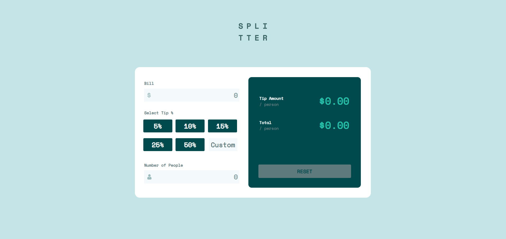

# Frontend Mentor - Tip calculator app solution

This is a solution to the [Tip calculator app challenge on Frontend Mentor](https://www.frontendmentor.io/challenges/tip-calculator-app-ugJNGbJUX). Frontend Mentor challenges help you improve your coding skills by building realistic projects.

## Table of contents

- [Overview](#overview)
  - [The challenge](#the-challenge)
  - [Screenshot](#screenshot)
  - [Links](#links)
- [My process](#my-process)
  - [Built with](#built-with)
  - [What I learned](#what-i-learned)
  - [Continued development](#continued-development)
  - [Useful resources](#useful-resources)
- [Author](#author)

## Overview

### The challenge

Users should be able to:

- View the optimal layout for the app depending on their device's screen size
- See hover states for all interactive elements on the page
- Calculate the correct tip and total cost of the bill per person

### Screenshot

### Links

- Solution URL: [Solution](https://github.com/CertIanS/tip-calculator-app)
- Live Site URL: [Live Site](https://certians.github.io/tip-calculator-app/)

## My process

### Built with

- Semantic HTML5 markup
- Flexbox
- CSS Grid
- Mobile-first workflow

### What I learned

I learned that for an input text field for numbers, the arrows can be hidden to make it look like a normal text field.

### Continued development

I found the CSS Flexbox to be useful for getting the different responsive designs, and I will continue to use it and other display options in future projects.

### Useful resources

- https://www.w3schools.com/howto/howto_css_hide_arrow_number.asp - This site was helpful for hiding the arrows/spinners from a number input field.

## Author

- Frontend Mentor - [@CertIanS](https://www.frontendmentor.io/profile/CertIanS)
